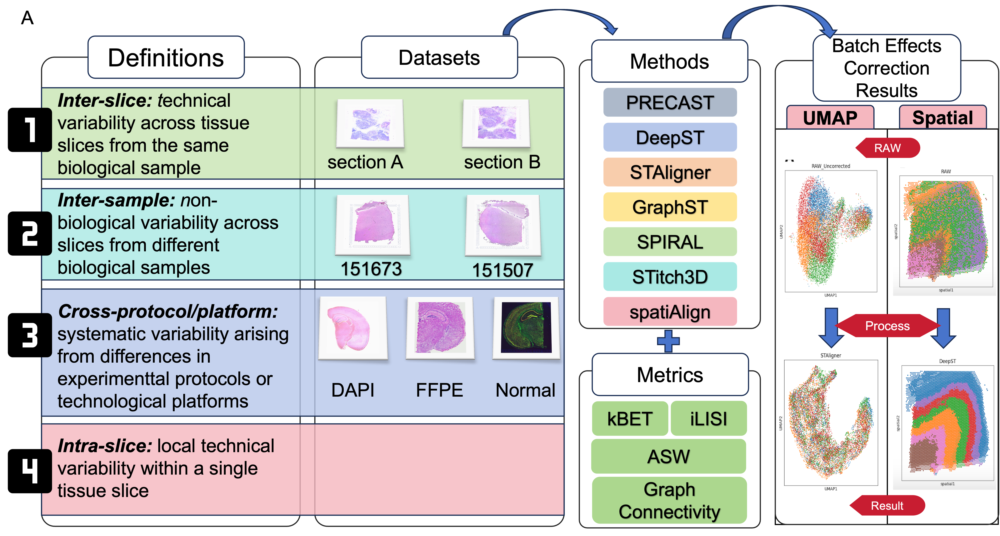

# Towards a Better Understanding of batch effects in Spatial Transcriptomics: Definition and Method Evaluation

We define batch effects in ST into four types based on their sources: (1) Inter-slice, (2)Inter-sample, (3) Cross-protocol/platform, and (4) Intra-slice. We assessed seven representative ST integration approaches: DeepST, STAligner, GraphST, STitch3D, PRECAST, spatiAlign, and SPIRAL, using benchmark datasets derived from human and mouse tissue samples. These methods were evaluated using a series of metrics—Graph connectivity(GC), kBET, ASW, and iLISI—in terms of both the preservation of biologically meaningful neighborhoods and effective batch mixing, thereby comprehensively validating the removal of batch effects. We also apply STAligner to perform downstream analysis before and after batch effects removal, further highlighting the importance of batch correction in ST analysis

Datasets:

Dataset1 consists of 12 human DLPFC sections, available at
https://research.libd.org/spatialLIBD/ with manual annotation

Dataset2 consists of Block A Section 1: https://support.10xgenomics.com/spatial-gene-expression/
datasets/1.1.0/V1_Breast_Cancer_Block_A_Section_1, Block A Section
2:https://support.10xgenomics.com/spatial-gene-expression/datasets/1.1.0/V1_Breast_Cancer_
Block_A_Section_2

Dataset3 consists of 3 slices from 3 different platforms: 10X:
https://www.10xgenomics.com/datasets/adult-mouse-olfactory-bulb-1-standards, The processed
Stereo-seq and Slide-seqV2 data can be downloaded from:https:
//drive.google.com/drive/folders/1Omte1adVFzyRDw7VloOAQYwtv_NjdWcG?usp=share_link.

Datasets4 consists of 3 slices from 3 different experimental protocols: ”10Normal”https://www.10xgenomics.com/datasets/mouse-brain-section-coronal-1-standard-1-1-0,
”10X-DAPI”:https://www.10xgenomics.com/datasets/
adult-mouse-brain-section-1-coronal-stains-dapi-anti-neu-n-1-standard-1-1-0,
”10X-FFPE”:https://www.10xgenomics.com/datasets/adult-mouse-brain-ffpe-1-standard-1-3-0X

Methods:

GraphST: https://github.com/JinmiaoChenLab/GraphST/tree/main

DeepST: https://github.com/JiangBioLab/DeepST

PRECAST:https://github.com/feiyoung/PRECAST

STAligner : https://github.com/zhanglabtools/STAligner

SPIRAL : https://github.com/guott15/SPIRAL

STitch3D : https://github.com/YangLabHKUST/STitch3D

spatiAlign : https://github.com/STOmics/Spatialign

