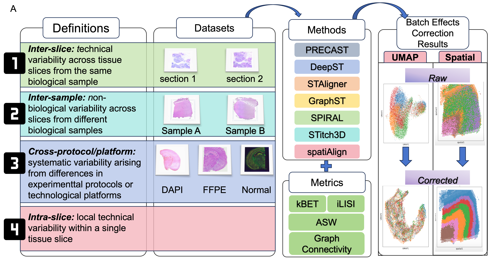

# Towards a Better Understanding of batch effects in Spatial Transcriptomics: Definition and Method Evaluation

We categorized batch effects in ST into four types based on their sources: (1) Inter-slice, (2) Inter-sample, (3) cross-protocol/platform, and (4) Intra-slice. Seven ST integration approaches were evaluated on benchmark datasets from human and mouse tissues. Using metricssuch as graph connectivity, kBET, ASW, and iLISI, we assessed both the preservation of biological neighborhoods and the effectiveness of batch correction. Additionally, we applied STAligner for downstream analysis to compare results before and after batch correction, further highlighting the importance of batch effect correction in ST analysis.

Datasets:

Dataset1 consists of 12 human DLPFC sections, available at https://research.libd.org/spatialLIBD/ with manual annotation

Dataset2 consists of Block A Section 1:  https://support.10xgenomics.com/spatial-gene-expression/datasets/1.1.0/V1_Breast_Cancer_Block_A_Section_1; 
Block A Section 2:https://support.10xgenomics.com/spatial-gene-expression/datasets/1.1.0/V1_Breast_Cancer_Block_A_Section_2

Dataset3 consists of 3 slices from 3 different platforms: 
10X: https://www.10xgenomics.com/datasets/adult-mouse-olfactory-bulb-1-standards;
The processed Stereo-seq and Slide-seqV2 data can be downloaded from: https://drive.google.com/drive/folders/1Omte1adVFzyRDw7VloOAQYwtv_NjdWcG?usp=share_link.

Datasets4 consists of 3 slices from 3 different experimental protocols: "10Normal" https://www.10xgenomics.com/datasets/mouse-brain-section-coronal-1-standard-1-1-0;
"10X-DAPI":https://www.10xgenomics.com/datasets/adult-mouse-brain-section-1-coronal-stains-dapi-anti-neu-n-1-standard-1-1-0;
"10X-FFPE":https://www.10xgenomics.com/datasets/adult-mouse-brain-ffpe-1-standard-1-3-0X.

Methods:

GraphST: https://github.com/JinmiaoChenLab/GraphST/tree/main

DeepST: https://github.com/JiangBioLab/DeepST

PRECAST:https://github.com/feiyoung/PRECAST

STAligner : https://github.com/zhanglabtools/STAligner

SPIRAL : https://github.com/guott15/SPIRAL

STitch3D : https://github.com/YangLabHKUST/STitch3D

spatiAlign : https://github.com/STOmics/Spatialign

